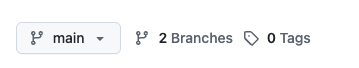

# Git tutorial

The tutorial is designed to give practical experience with Git.
Various interfaces rely on it. 
In this tutorial, Git functionality is explained using GitHub, but there are other web interfaces, including [GitLab](https://about.gitlab.com/) and [Bitbucket](https://bitbucket.org/product/).
Most of the functionality can be accessed via the browser, so it is not necessary to have Git installed on your computer for basic usage.
We will provide instructions on how to use the browser interface alongside the command line interface.

## No code knowledge is required to start

Based on experience, it is simpler not to start with coding examples when learning about Git.
Instead, we will use a text file, since code is ultimately just text.

## Q: How do I share my text with people?

### Create a repository

To start the tutorial, we need to create a repository.
The repository will serve as a place to store our text file.
To create a repository, please go to your GitHub account, select the "Repositories" tab and click on the green "New" button.
Alternatively, you can click on [this link](https://github.com/new).
In the newly opened page, please fill in the following fields:
- **Repository name**: `git-tutorial`.
- (optional) **Description**: `Git tutorial`.
- **Public**: (leave it as is).
- **Initialize this repository with a README**: (leave it unchecked).
- **Add .gitignore**: None (default).
- **Choose a license**: None (default).

After that, please click on the green "Create repository" button.

Congratulations, you have created your first GitHub repository!
The repository is empty, so we need to add a file to it.

### Public vs Private repositories

Issue [#9](https://github.com/empa-scientific-it/how-to-git/issues/9)

### Add a file to the repository
To add a file to the repository, please click on the "uploading an existing file" link.
In the newly opened page, please drag and drop a text file to the drag and drop area.
You can create the file on your computer using any available text editor.
The file can contain any text you want, but usually the programmers like to put "Hello, World!", so let's follow the tradition.
The filename does not matter.

Let's not modify any other fields and click the green "Commit changes" button.
Congratulations, you have added a file to the repository!

## Q: How do I track changes to my file?

Issue [#10](https://github.com/empa-scientific-it/how-to-git/issues/10)

### Change files

Issue [#10](https://github.com/empa-scientific-it/how-to-git/issues/10)

### Commit changes

Issue [#10](https://github.com/empa-scientific-it/how-to-git/issues/10)

### Check the history

Issue [#10](https://github.com/empa-scientific-it/how-to-git/issues/10)

## Q: How to work on different topics in parallel?

### Plan your work and record issues

Issue [#3](https://github.com/empa-scientific-it/how-to-git/issues/3).

### Branching out topics

Often, you will want to work on different topics in parallel and keep them separate from the main codebase.
Those include the development of new features, bug fixes, or experiments.
Git is offering the possibility for branching out.
This is like working on isolated copies of your files, try out new things until everything works: in Git, this is called a branch.
After the person is satisfied with the changes, they can merge them back into the main codebase (`main` branch or `master` branch).

The main branch in Git is often called `main` or `master`, and it represents the stable version of your code.
When you want to work on a new feature or fix a bug, you create a new branch from the `main` branch.
One should not hesitate to create branches, cause they are lightweight and simple to create and merge.

To create a new branch, you can use the GitHub interface.
There are different ways how to create branches: From the repository; In the dialogue window for a commit; from an issue - and probably there are even more possibilities.
Following the one from the repository is explained:
1. Go to your repository.
2. Click on the "main" dropdown button.

3. In the text field, type the name of your new branch (e.g., `feature-xyz`).
4. Press Enter to create the branch.

And now you can switch to this branch and start working on your new feature or bug fix.

If you are curious what it looks like in the commit history, you can go to "Insights" tab of your repository and select "Network" from the left sidebar.
This will show you a graphical representation of your branches and commits.
You will notice that the new branch is simply a pointer to a specific commit in the history.
If the branch is freshly created, it will point to the same commit as the `main` branch, so the code in the new branch is still the same as in the `main` branch.
However, as you make changes in the new branch, it will diverge from the `main` branch and will have parts that are different from the `main` branch.

### Switch between branched-out topics

To switch between branches, you can use the GitHub interface:
1. Go to your repository.
2. Click on the "main" dropdown button right below the repository name.

3. Select the branch for your topic of interest you want to switch to (e.g., `feature-xyz`).

Once you switch to a branch, the files in your repository will be updated to reflect the state of that branch.
Meaning, it can be that it looks different from before, since you changed files for new features or bug fixes.
You can now make changes to the files.
Once you commit them, they will be pushed, as in saved, to that branch that you chose from the drop-down in the beginning.

### Develop in a branch

Developing in a branch is a common practice in Git.
It allows you to work on new features or bug fixes without affecting the main codebase.

That also gives you a freedom to experiment with your code, add changes, remove changes and even rewrite the history of your branch.
The idea here is that once your changes are ready, you can merge them back into the `main` branch and write a clean commit message that describes the changes you made.
Once you are in a branch, you can make changes to your files, commit them and push them to the remote repository.
You can also create new files, delete files, and rename files - everything will remain in the branch until you decide to merge it back into the `main` branch.

### Merge branches

Once you are done with your work in a branch, you can merge it back into the `main` branch making sure that your changes are integrated into the main codebase.
To do that, you can use the GitHub interface:
1. Go to your repository.
2. Click on the "Pull requests" tab.
3. Click on the green "New pull request" button.

4. Select the branch you want to merge from (e.g., `feature-xyz`) and the branch you want to merge into (e.g., `main`).
   After that, you will see a comparison of the two branches and a list of commits that will be merged.
5. Click on the green "Create pull request" button.
6. In the newly opened page, you can add a title and a description for your pull request.
Later you will be able to find that pull request by that title.
   This is a good place to explain what changes you made and why they are important.
   Also, you can assign reviewers to your pull request, so they can review your changes and give feedback.
7. Once you are done, click on the green "Create pull request" button again.

After that, your pull request will be created and you can see it in the "Pull requests" tab.
You can continue to work on your branch, and after every commit, the pull request will be updated with the new changes.
Once the work is done, you can merge the pull request by clicking on the green button that says "Merge pull request", "Squash and merge", or "Rebase and merge".
Usually, you can use Merge or Squash, but more on this topic can be found [here](https://docs.github.com/en/pull-requests/collaborating-with-pull-requests/incorporating-changes-from-a-pull-request/about-pull-request-merges).
This will merge your changes into the `main` branch and close the pull request.

## Q: How to collaborate with others?

### Manage access to the repository

Issue [#11](https://github.com/empa-scientific-it/how-to-git/issues/11).

### Report problems and give suggestions

Issue [#3](https://github.com/empa-scientific-it/how-to-git/issues/3).

